# Session 2b - Cloud Computing & Bash Scripting

## Lab Objective

The objective of Session 2B was to develop practical skills in cloud computing, Linux administration, and system automation. Through deploying a Linux virtual machine on Microsoft Azure, configuring an Apache web server, managing files, creating Bash scripts, implementing loops and conditionals, and automating system monitoring tasks, students gained hands-on experience with modern server management and automation techniques used in real-world IT environments.

---

# Part 2b-1 – Cloud Web Server Deployment (Microsoft Azure)

## Deliverable 1 – Azure Virtual Machine Created

An Ubuntu virtual machine was successfully created in Microsoft Azure and configured with a public IP address for remote access.

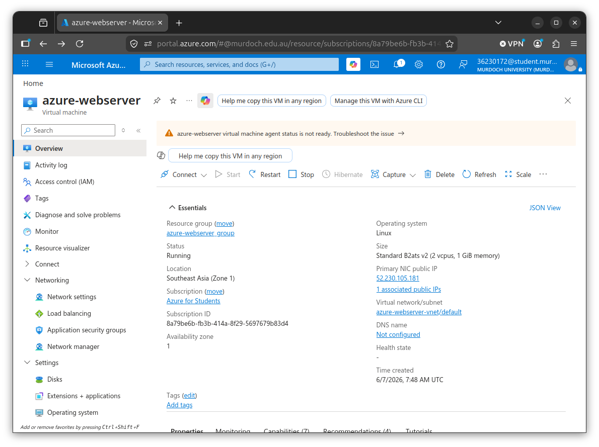

---

## Deliverable 2 – Network Security Rules Configured

Inbound rules were configured to allow SSH (Port 22) and HTTP (Port 80) traffic to reach the virtual machine.

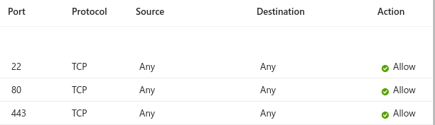

---

## Deliverable 3 – SSH Access Established

A secure SSH connection was successfully established to remotely manage the Azure virtual machine.

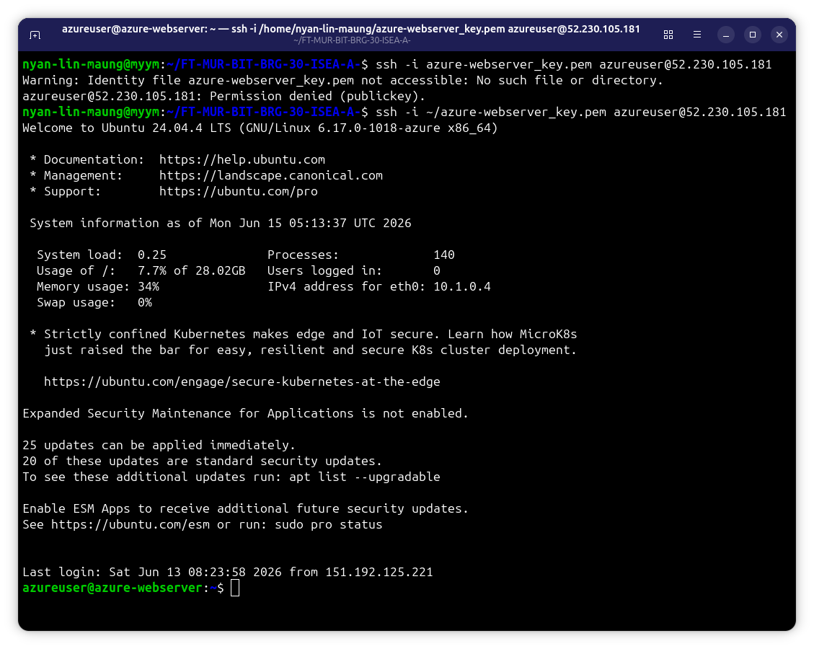

---

## Deliverable 4 – Apache Web Server Installed and Tested

Apache Web Server was installed on the Ubuntu virtual machine and verified through a web browser.

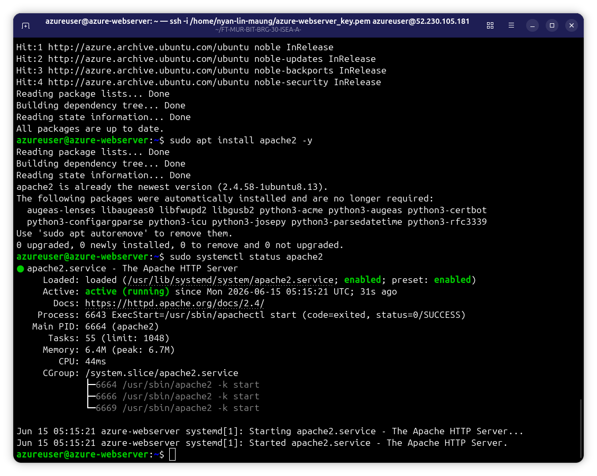

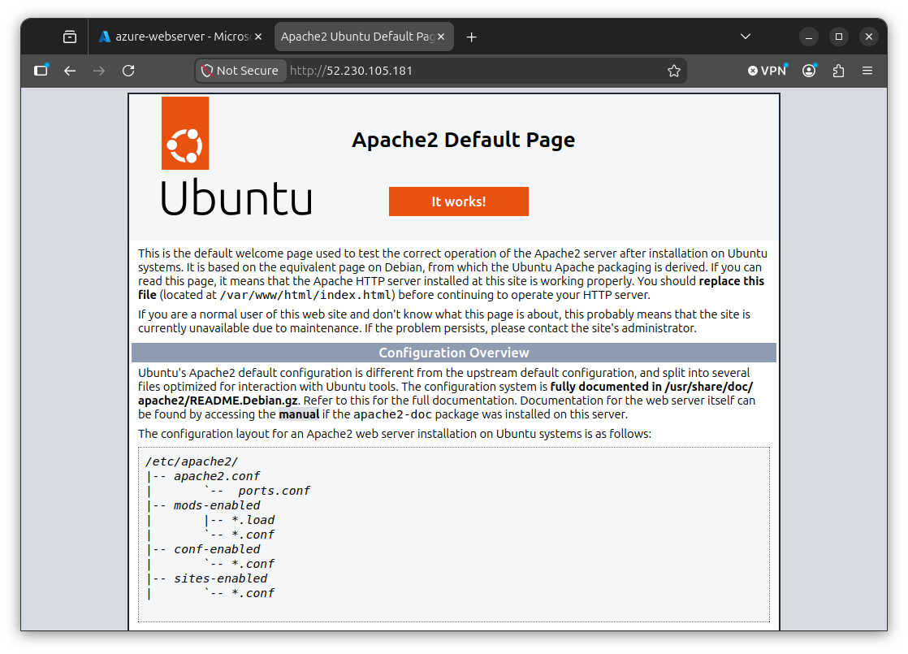

---

## Deliverable 5 – Custom Web Page Created

The default Apache homepage was modified with personalized content and successfully displayed through the browser.

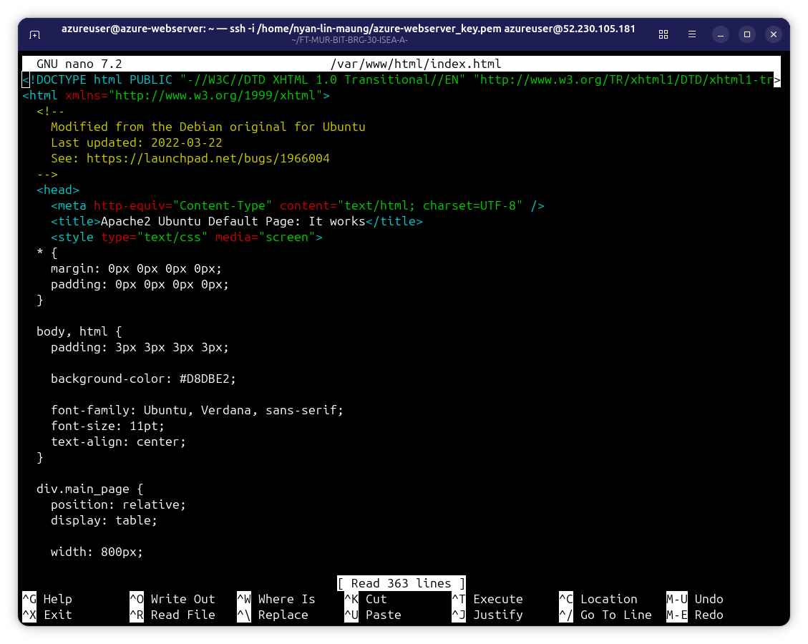

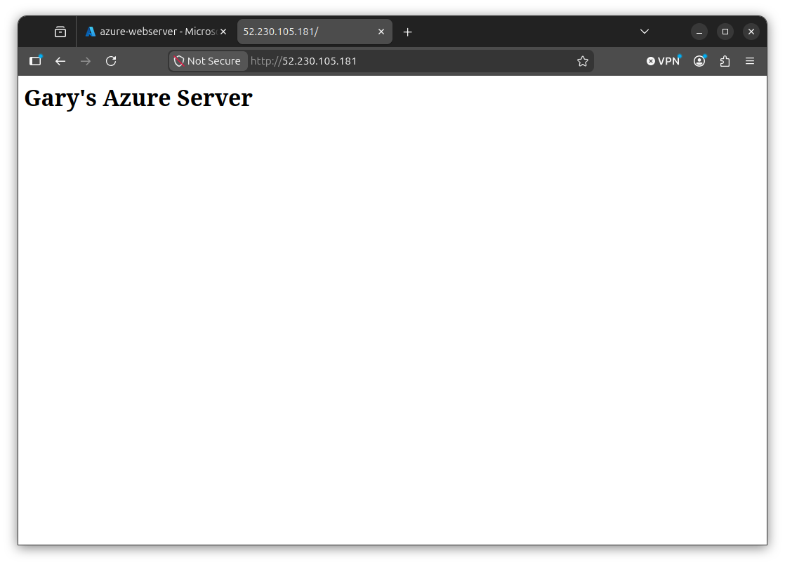

---

## Deliverable 6 – External File Downloaded

A file was downloaded onto the virtual machine using the wget command.

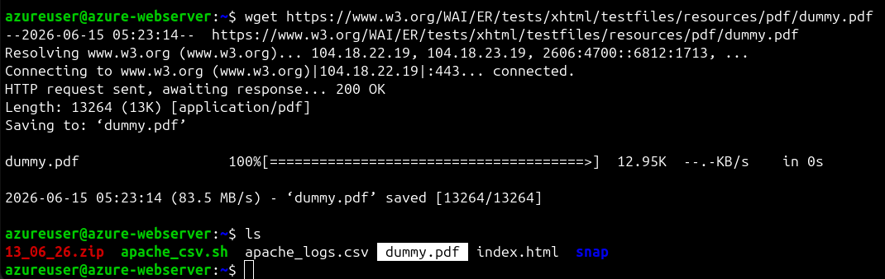

---

## Deliverable 7 – File Published to Web Server

The downloaded file was copied into Apache's web directory and made accessible through the website.

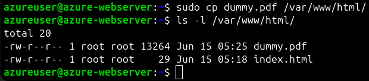

---

## Deliverable 8 – File Access Verified

The uploaded file was successfully accessed using the virtual machine's public IP address.

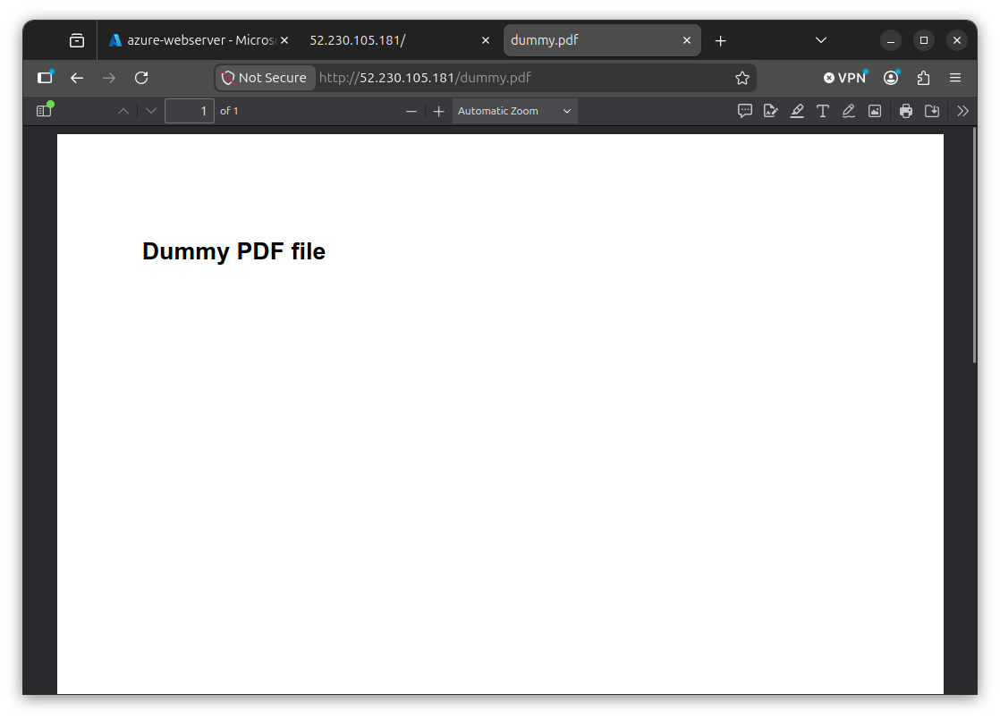

---

## Deliverable 9 – Hyperlink Added to Web Page

A hyperlink was created within the webpage to provide direct access to the uploaded file.

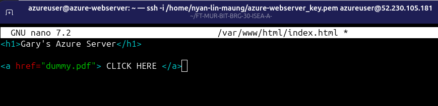

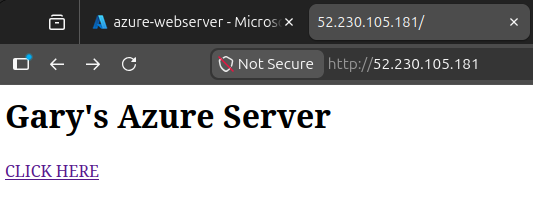

---

## Deliverable 10 – Cost Monitoring Reviewed

Azure Cost Management tools were reviewed to understand cloud resource usage and billing.

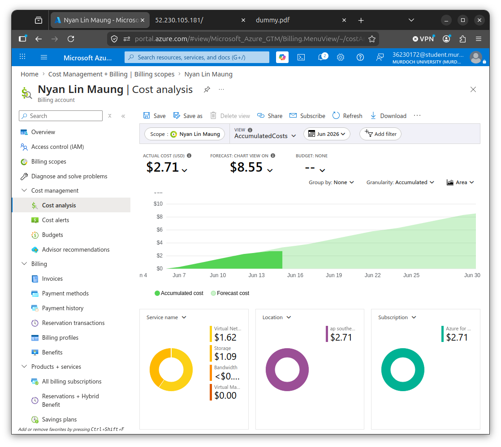

---


# Part 2b-2 – Introduction to Bash Scripting & System Automation

## Deliverable 1 – Directory and File Operations Completed

Basic Linux file management commands were used to create directories, create files, copy files, rename files, and remove files.

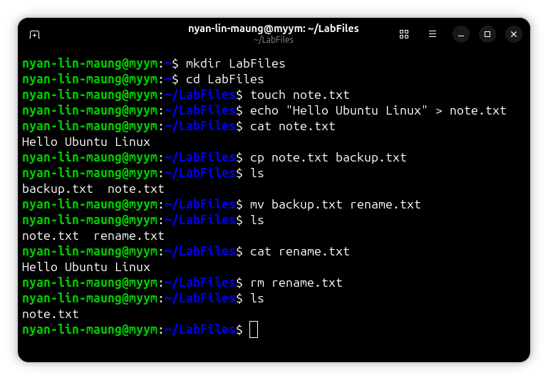

---

## Deliverable 2 – Reflection on File System Commands

Understanding of Linux file system commands was demonstrated through written responses explaining directory creation, file viewing, and file management operations.

### What command creates a directory?
```bash
mkdir
```

### How do you view file content without a GUI?
```bash
cat filename
```

### Difference between cp and mv?
```text
cp copies a file
mv moves or renames a file
```

---

## Deliverable 3 – Basic Bash Script Created and Executed

A simple Bash script was created using the shebang (`#!/bin/bash`) and executed successfully after assigning executable permissions.

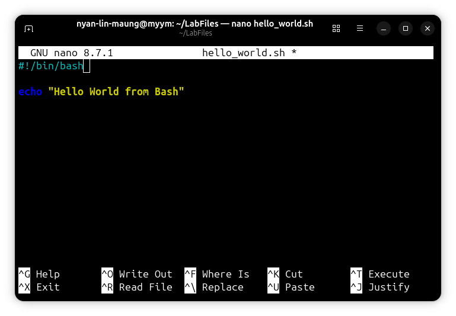

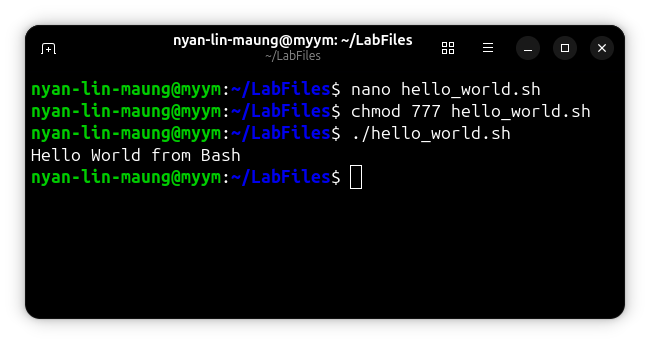

---

## Deliverable 4 – Reflection on Script Fundamentals

Written responses demonstrated understanding of executable permissions, script execution, and script customization.

### What is chmod +x for?
```text
It gives execute permission to a script.
```

### Why is #!/bin/bash used?
```text
It tells Linux to execute the script using Bash.
```

### How can script output be personalized?
```text
Custom messages and variables can be added.
```

---

## Deliverable 5 – Loop and Conditional Script Developed

A Bash script was created using loops, user input, and conditional statements to perform simple decision-making tasks.

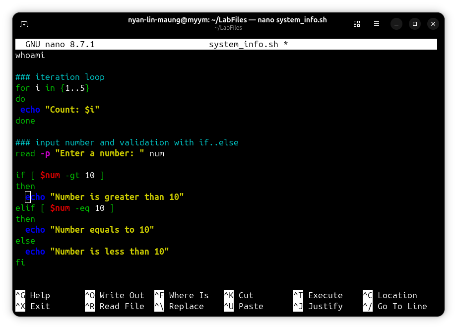

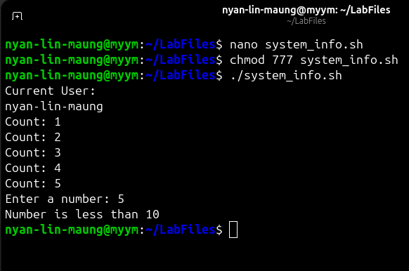

---

## Deliverable 6 – Reflection on Loops and Conditionals

The behavior of loops and conditional structures was analyzed through written reflections and explanations.

### How does the "for" loop work?
```text
It repeats commands for each value in a sequence.
```

### What happens if the number is greater than 10?
```text
The first condition becomes true, and the corresponding message is displayed.
```

### How could invalid input be handled?

Invalid Input can be handled with the following script:
```bash
if ! [[ $num =~ ^[0-9]+$ ]]
then
  echo "Invalid Input" 
fi
```

---

## Deliverable 7 – System Monitoring Script Executed

A system monitoring script was created to display CPU, memory, and disk usage information using Linux monitoring commands.

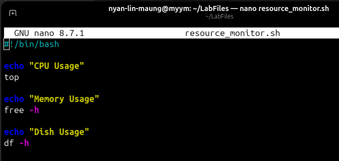

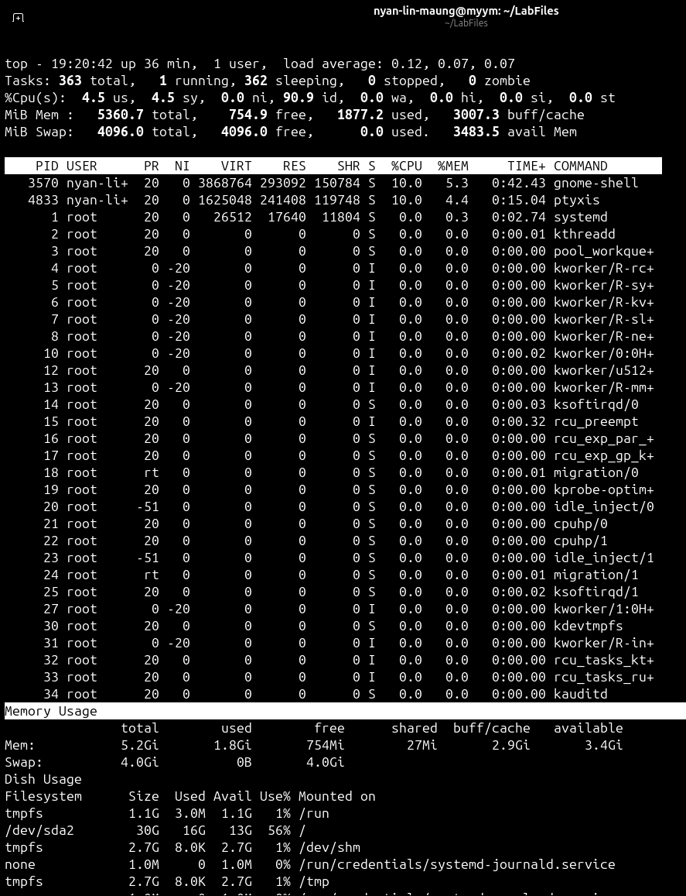

---

## Deliverable 8 – Reflection on Monitoring Automation

Written responses explained the purposes of automation and system monitoring and outlined possible enhancements for future monitoring tasks.

### What does free -h show?
```text
It displays system memory usage in a human-readable format.
```

### How could the script monitor network usage?
```text
Commands such as "ifconfig", "ip", or "vnstat" can be added.
```

### Why is automation important?
```text
Automation reduces manual work, saves time, and improves consistency.
```

---

## Summary

Session 2B provided practical experience in both cloud infrastructure deployment and Linux system automation. The activities involved creating and managing an Azure virtual machine, configuring a web server, hosting web content, transferring files, writing and executing Bash scripts, implementing loops and conditional statements, and automating system monitoring tasks. These exercises strengthened technical skills in Linux administration, cloud computing, scripting, troubleshooting, and automation while demonstrating how these technologies work together to improve system management and operational efficiency.
