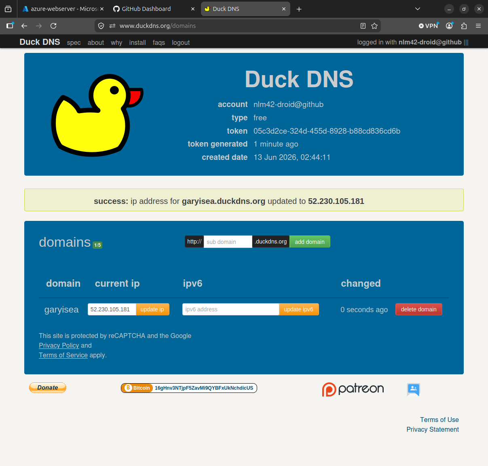
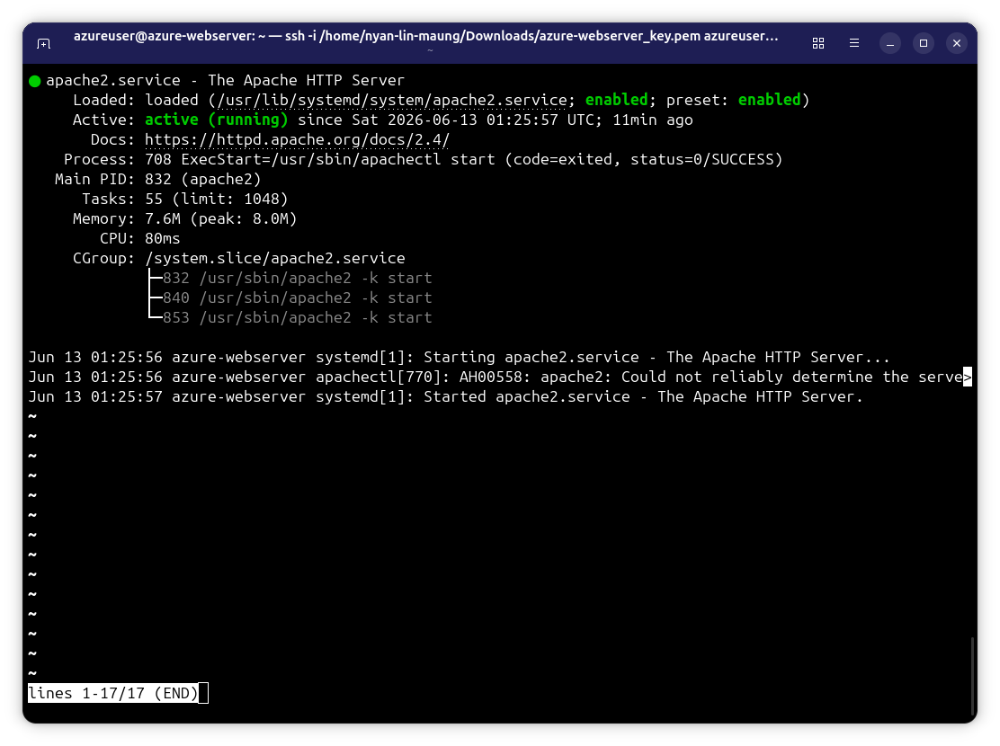
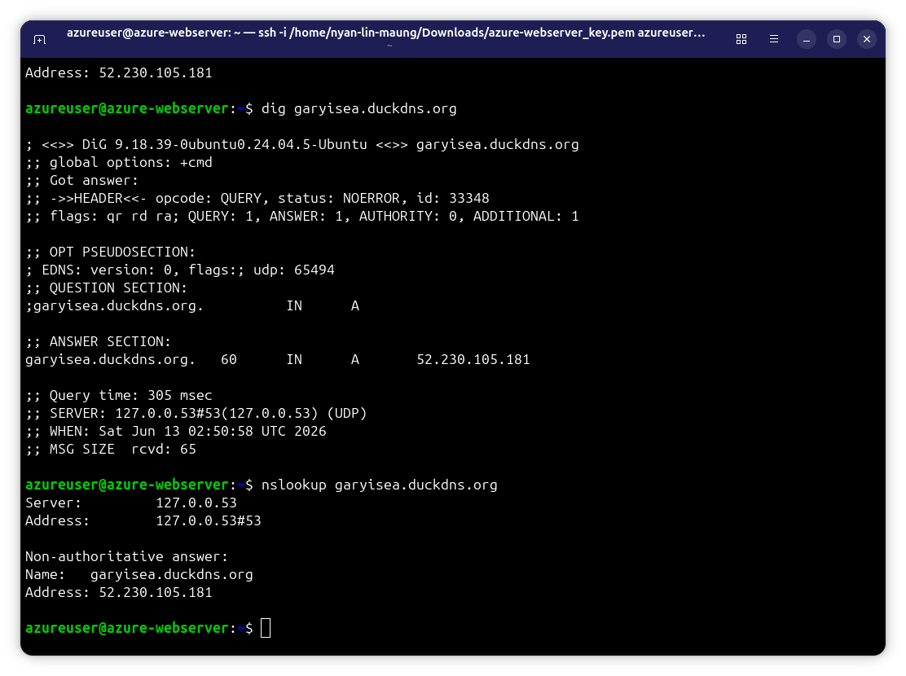
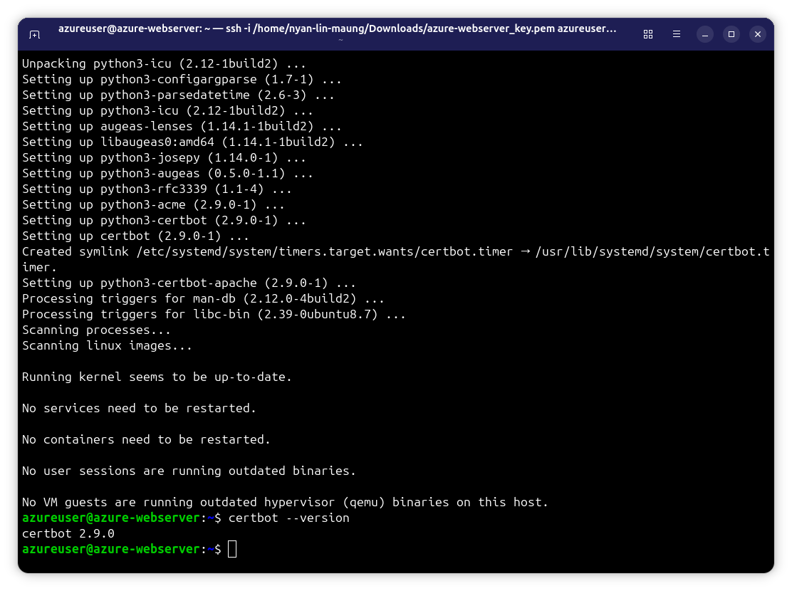
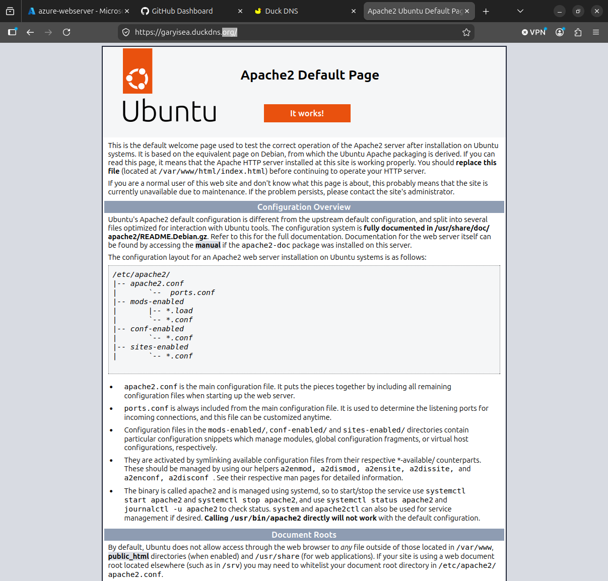
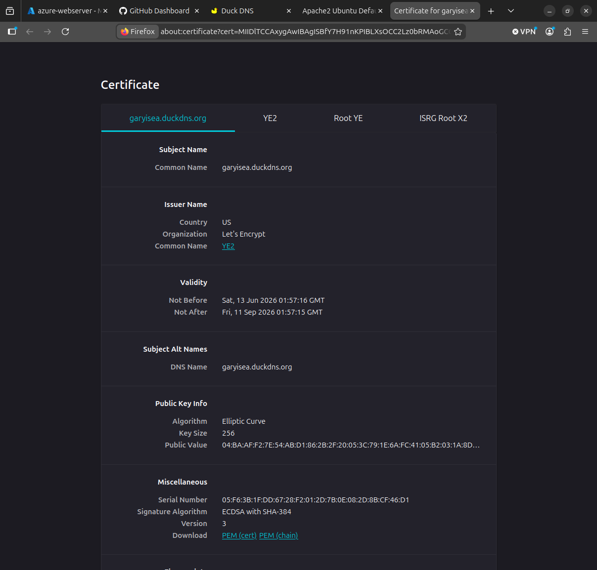
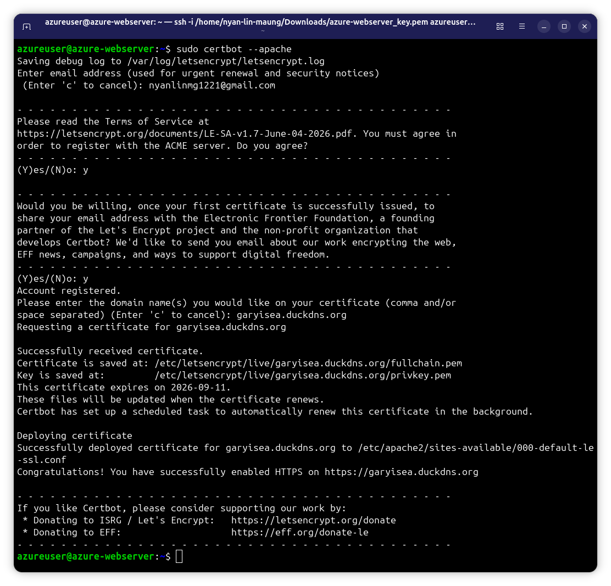
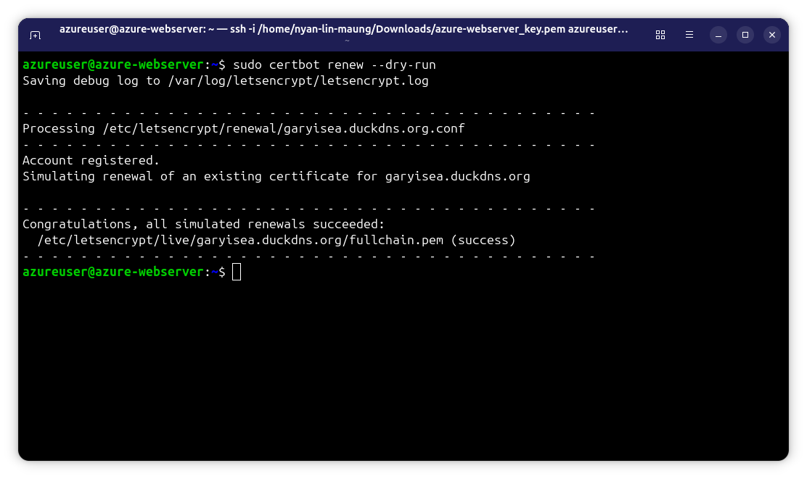
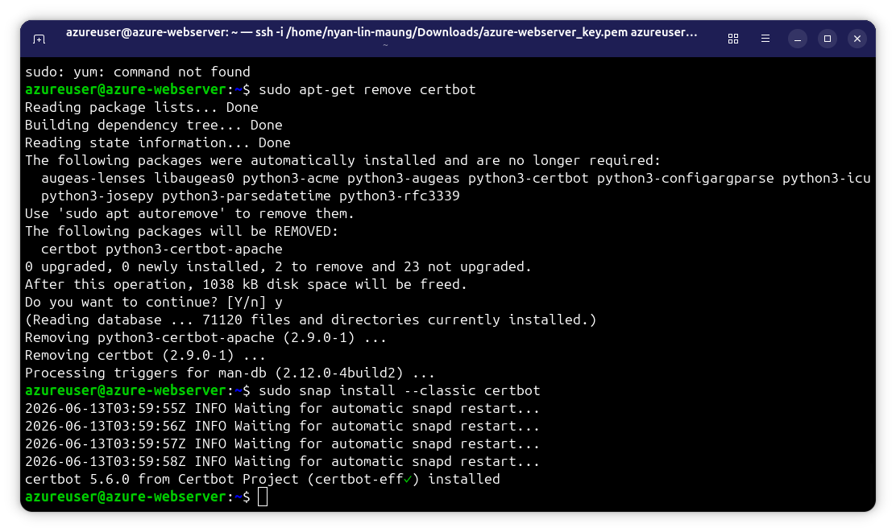
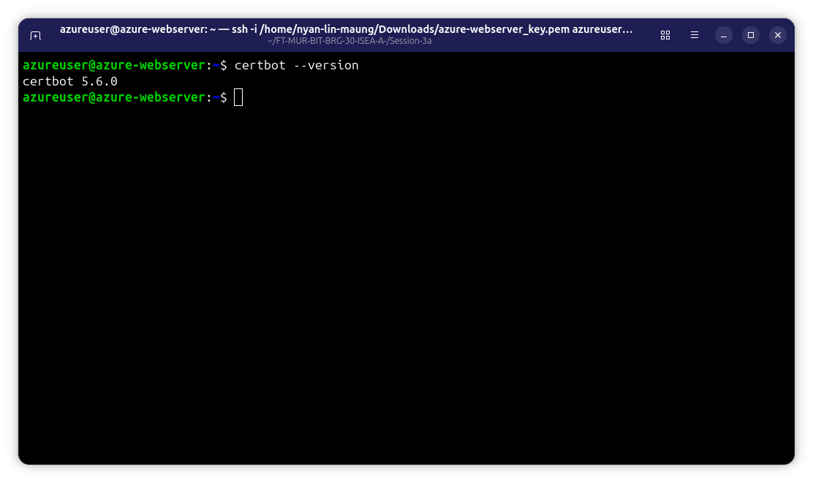

# Session 3a - Domain, DNS, HTTPS and TLS Certification

# Part 3a-1 : Domain, DNS and TLS certificates with Let's Encrypt


## Lab Objective

The object of this lab was to configure a cloud-hosted Ubuntu server, install and configure an Apache web server, register and cinfigure a domain name, verify DNS functionality, and secure the website using HTTPS with a TLS certificate issued by Let's Encrypt. The lab also provided practical experience with domain managemnet, DNS resolution, web server deployment, and certificate management using Certbot.

## Activity 1 - Domain, DNS

## Deliverable 1 : Domain Name Registered

A domain name was registered using a DNS provider (Duckdns). The domain provides a human-readable address that can be used to access the web server instead of using the server's public IP address.


## Deliverable 2 : A Record Created

A DNS A reocrd was configured to map the domain name to the Azure VM public IP address. This allows users to access the server through the registered domain.




## Deliverable 3 : Apache Installed

Apache2 was installed on the Ubuntu VM and verified to be running successfully. The Apache web server is used to host web content and respond to HTTP requests.

### Commands Used 

```bash
sudo apt update
sudo apt install apache -y
sudo systemctl status apache2
```




## Deliverable 4 : Public IP to Domain Mapping Verified

DNS lookup tools were used to verify that the domain correctly resolves to the Azure VM public IP address. The successful lookup confirmed that the DNS configuration was working properly.

### Commands Used

```bash
nslookup garyisea.duckdns.org
dig garyisea.duckdns.org
```




## Deliverable 5 : Apache Welcome Page via Domain

The Apache default webpage was successfully accessed using the configured domain name. This confimred that the DNS settings and Apache web server were functioning correctly.


## Deliverable 6 : DNS Test Output

**Refers to the Deliverable 4


## Activity 2 - Let's Encrypt TLS Certificate Setup

## Deliverable 1 : Certbot Installation

Cerbot and the Apache plugin were installed on the Ubuntu server. Certbot is used to automate the process of obtaining and managing TLS certificates from Let's Encrypt.

### Commands Used

```bash
sudo apt update
sudo apt install certbot python3-certbot-apache -y
certbot --version
```




## Deliverable 2 : HTTPS Enabled on Domain

HTTPS were enabled successfully using TLS certificate issued by Let's Encrypt. Secure communication between users and the server was established.




## Deliverable 3 : Valid TLS Certificate

A valid TLS certificate was issued and installed successfully. The certificate verified the website's identity and enabled encrypted communication.




## Deliverable 4 : HTTPS with Lock Icon

The browser displayed a shield icon insted of Lock Icon. Refers to Deliverable 2.


## Deliverable 5 : Certbot Success Message

Certbot successfully obtained and installed the TLS certificate from Let's Encrypt. Apache was automatically configured to support HTTPS.

### Commands Used

```bash
sudo certbot --apache
```




### Deliverable 6 : Renewal Dry-Run Output

A certificate renewal dry-run was performed successfully. This confirmed that future certificate renewals can occur automatically before the certificate expires

### Commands Used

```bash
sudo certbot renew --dry-run
```




# Part 3a-2 : Enabling HTTPS with Let's Encrpyt & Certbot

## Most of the deliverables from Session 3a-2 repeat the Session 3a-1

## Deliverable 1 : Domain Points to Server

Same to Deliverable 4 in 3a-1


## Deliverable 2 : Certbot installed via Snap

Firstly, I uninstall the certbot which installed using "apt" and reinstall again using snap command. Then, checking the certbot version using the appropiate command.

### Commands Used

```bash
sudo snap install --classic certbot
certbot --version
```






## Deliverable 3 : Certificate successfully issued

Refers to deliverable 5 - Activity 2 - Session 3a-1


## Deliverable 4 : HTTPS Enabled on Apache

Refers to deliverable 2 - Activity 2 - Session 3a-1


## Deliverable 5 : Browser Lock Icon

Refers to deliverable 2 - Activity 2 - Session 3a-1


## Deliverable 6 : View Certificate Issuer

Refers to deliverable 3 - Activity 2 - Session 3a-1


## Deliverable 7 : Certbot Auto-Renewal Dry Run Successful

Refers to deliverable 6 - Activity 2 - Session 3a-1


# Summary

This lab successfully demonstrated domain and DNS configuration, Apache web server deployment, and HTTPS implementation using Let's Encrypt and Certbot. All required deliverables were completed and verified successfully.
