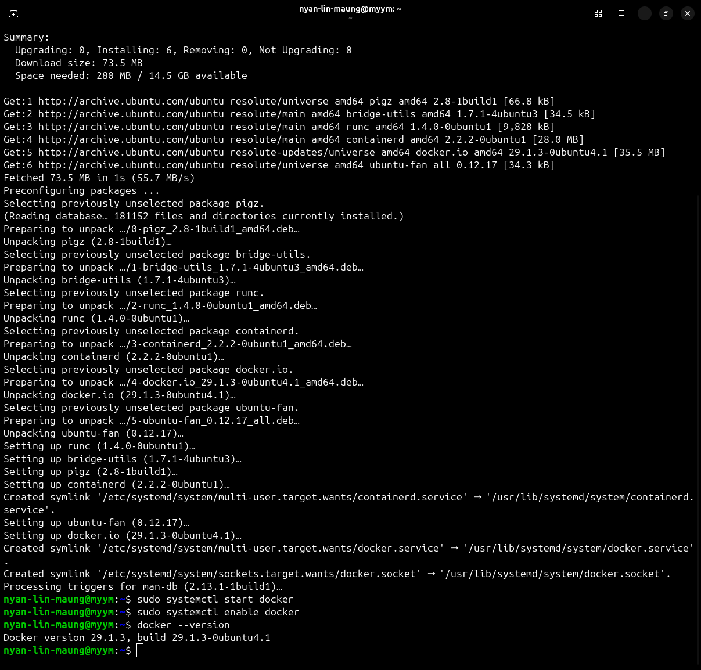
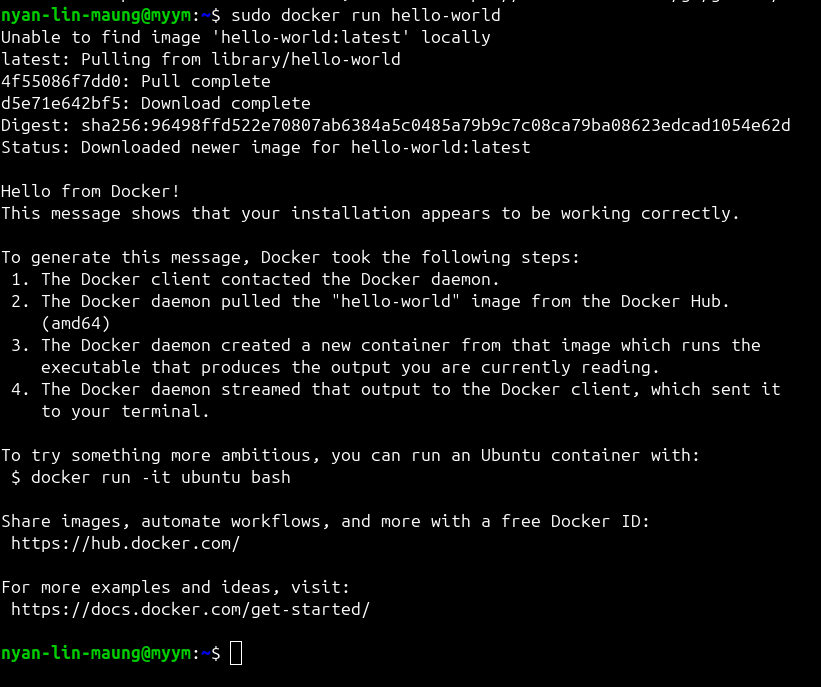
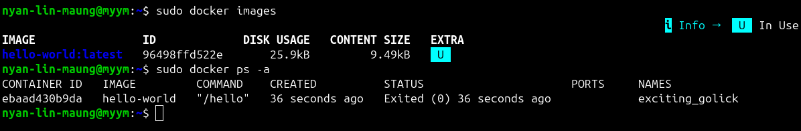
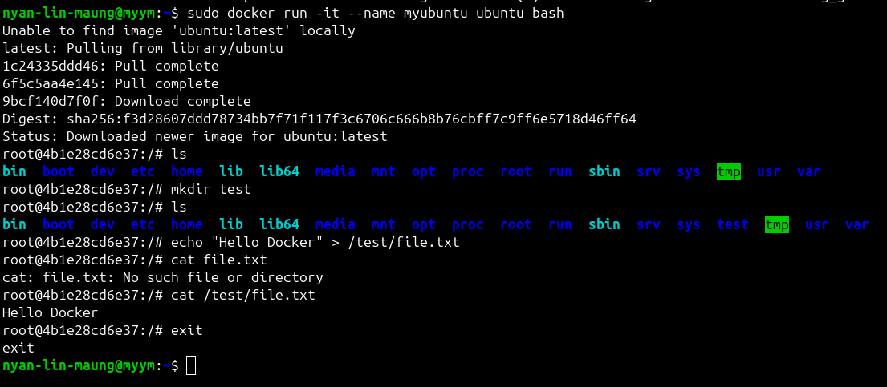
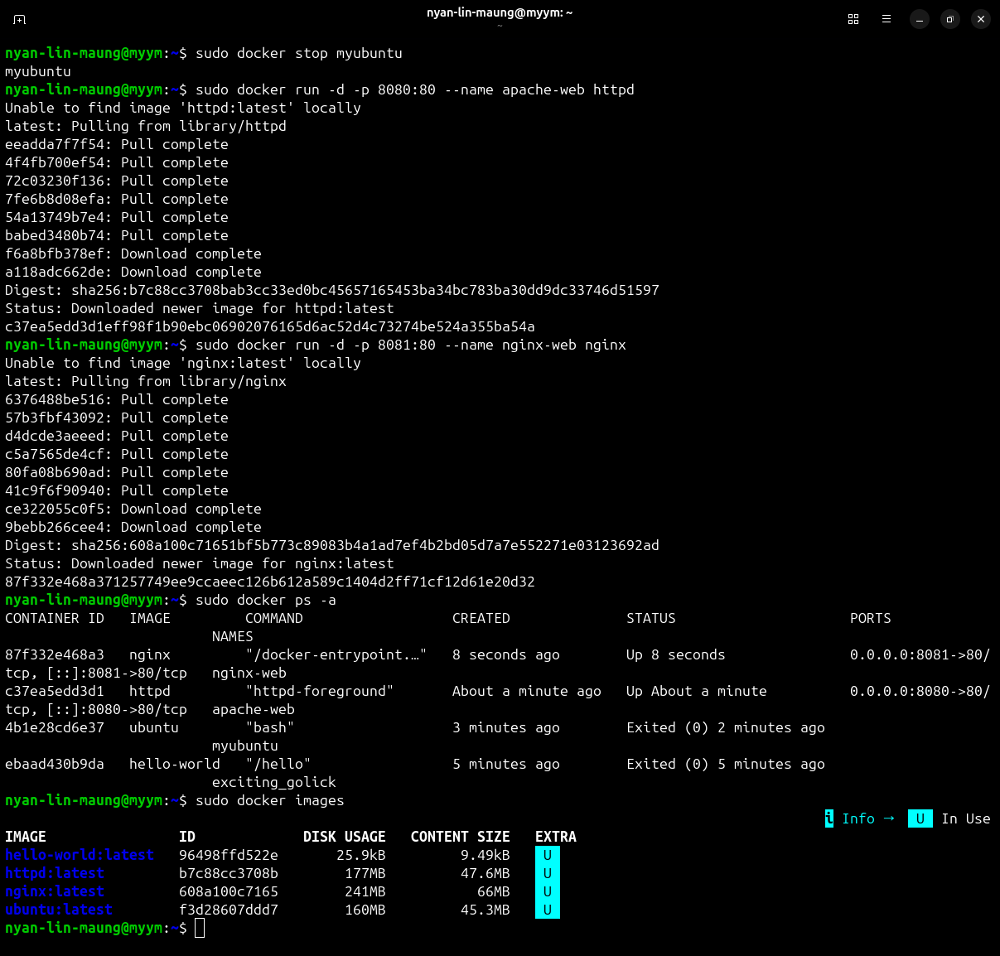
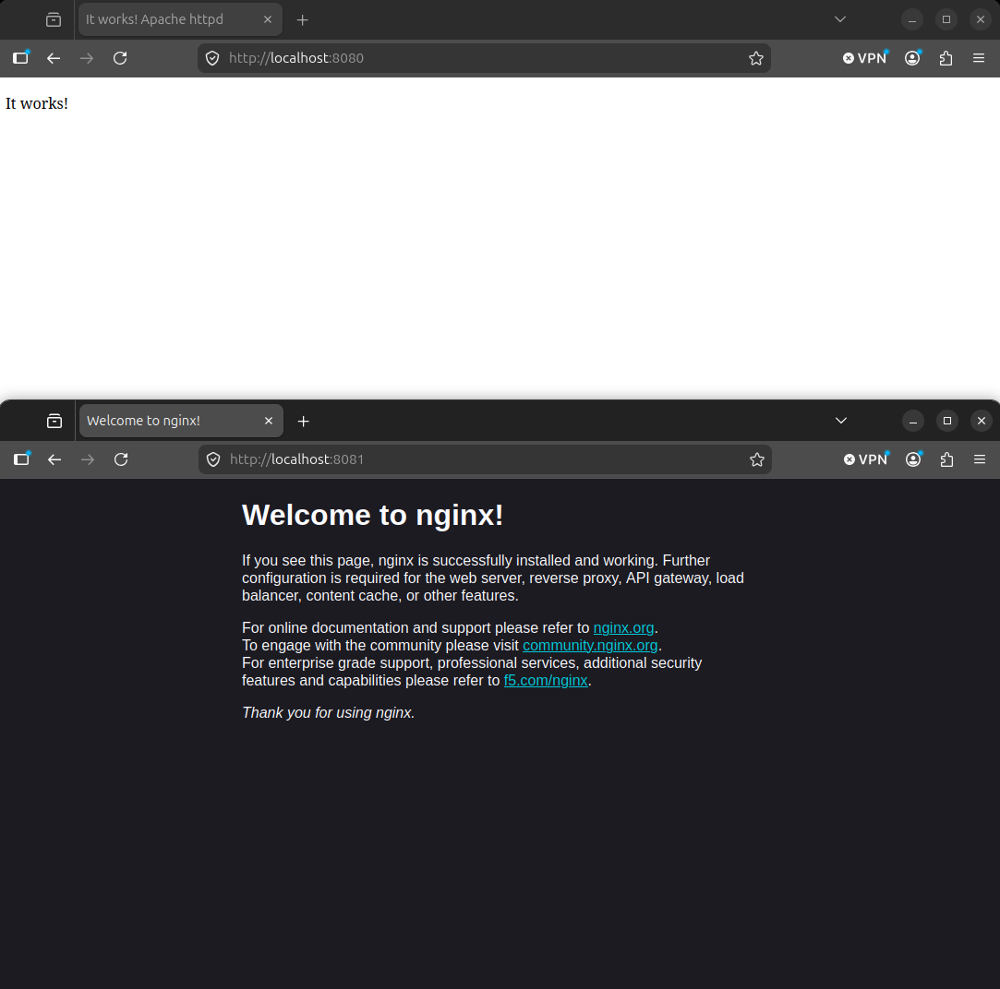

# Session 3b – Server Automation

# Lab Objective

The objective of this lab was to create and automate file backups using Bash scripting. The lab involved creating backup scripts, compressing files into ZIP archives, scheduling automated execution using cron jobs, and transferring backup files to a cloud server using SCP.


## Part 3b-1 - Bash Backup Scripting, Cron Jobs, and Cloud Export

## Deliverable 1: Practice Bash Commands Executed

Basic Bash commands were tested to demonstrate variables, arithmetic operations, and loops.

### Commands Used

```bash
echo "Hello World"

name="Gary"
echo $name

x=5
y=10
echo $((x+y))

sum=0
for i in 1 3 5 7 9
do
    sum=$((sum+i))
done
echo $sum
```


---

## Deliverable 2: Test Files & Directories Created

Test files and directories were created inside the Documents folder.

### Commands Used

```bash
mkdir -p ~/Documents/TestFolder
touch ~/Documents/file1.txt
touch ~/Documents/file2.txt
ls -R ~/Documents
```


---

## Deliverable 3: Basic Script Working (testscript)

A Bash script was created to copy files from Documents into a backup directory.

### Commands Used

Create script:

```bash
nano ~/testscript
```

Example script:

```bash
#!/bin/bash

mkdir -p /home/nyan-lin-maung/backup
cp -R /home/nyan-lin-maung/Documents/* /home/nyan-lin-maung/backup/

echo "Backup Completed"
```

Make executable:

```bash
chmod 777 ~/testscript
```

Run script:

```bash
~/testscript
```


---

## Deliverable 4: Script Moved to /usr/bin and Tested

The script was moved to a system directory so it could be executed from any location.

### Commands Used

```bash
sudo mv ~/testscript /usr/bin/testscript
sudo chown root:root /usr/bin/testscript
```

Test:

```bash
testscript
```


---

## Deliverable 5: ZIP Archive with Date Filename

The script was updated to generate a ZIP archive using the current date.

### Commands Used

```bash
now=$(date +"%d_%m_%y")
zip -r $now.zip /home/nyan-lin-maung/backup/*
cp $now.zip /home/nyan-lin-maung/
```

Check:

```bash
ls -lh /home/nyan-lin-maung
```


---

## Deliverable 6: Cronjob Set Up for Hourly Backup

A cron job was created to execute the backup script automatically every hour.

### Commands Used

Edit crontab:

```bash
sudo nano /etc/crontab
```

Add:

```bash
9 * * * * nyan-lin-maung /usr/bin/testscript
```

Verify:

```bash
cat /etc/crontab
```


---

## Deliverable 7: Successful Cron Execution Verified

The cron job was verified to create backup files automatically.

### Commands Used

```bash
ls -lh ~/*.zip
```

In this deliverable, I used

```bash
* * * * * nyan-lin-maung usr/bin/testscript
```

Instead of

```bash
9 * * * * nyan-lin-maung usr/bin/testscript
```

Proving the file backup every minute


---

## Deliverable 8: SCP to Cloud Working

The script was updated to transfer backups to a remote cloud server.

### Commands Used

```bash
scp -i azure-webserver_key.pem ~/$now.zip azureuser@52.230.105.181:/home/azureuser
```

Verify on remote server:

```bash
ls -lh ~/
```


---

## Deliverable 9: SSH Certificate Accepted by Root

SSH key authentication was tested and the host fingerprint was accepted.

### Commands Used

```bash
sudo ssh -i ~/azure-webserver_key.pem azure@52.230.105.181
```

When prompted:

```text
yes
```


---

## Deliverable 10: Final Script Submitted

The completed script contained:

* Recursive backup
* ZIP compression
* Date-based filenames
* SCP transfer
* Full paths for cron compatibility

### Example Final Script

```bash
#!/bin/bash

now=$(date +"%d_%m_%y")

mkdir -p /home/nyan-lin-maung/backup

cp -R /home/nyan-lin-maung/Documents/* \
/home/nyan-lin-maung/backup/

zip -r $now.zip /home/nyan-lin-maung/backup/*

cp $now.zip /home/nyan-lin-maung/

scp -i /home/nyan-lin-maung/azure-webserver_key.pem $now.zip \
azureuser@52.230.105.181:/home/azureuser/

echo "Backup Completed"
```


---

##  Part 3b-2 - Additional Server Service

## Deliverable 1 : Installation of Docker

I have installed the docker.io using the following commands line. Firstly, I check whether the packages needed to upgrade or not? After updating, I have installed docker using ubuntu repository. Then, I start and enable the docker, and I check the version of docker to verify the installation.

### Commands Used

```bash
sudo apt update
sudo apt upgrade -y

sudo apt install -y docker.io

sudo systemctl start docker
sudo systemctl enable docker
docker --version
```



---

## Deliverable 2 : Running hello-world

When I run ``` sudo docker run hello-world ```
, docker looks for a local image called ``` hello-world ```
. If it doesn't exist, Docker downloads hello-world image from Docker Hub.

Docker then creates a container from that image and runs it.
The container executes a program that prints:

```text
Hello from Docker!
This message shows that your installation appears to be working correctly.
```




Because its job is finished, the container exits immediately.

I verified it with
```bash
sudo docker images
sudo docker ps -a
```



---

## Deliverable 3 : Ubuntu with Docker

I created an Ubuntu container and accessed its terminal. I tested basic Linux commands and created files. From this deliverable, I learnt that containers have their own isolated environment.

### Commands Used

Creating Ubuntu container

```bash
sudo docker run -it --name myubuntu ubuntu bash
```

Inside Docker's Ubuntu, I tested with basic commands.

```bash
ls
mkdir test
echo "Hello Docker" > /test/file.txt
cat /test/file.txt
exit
```



---

## Deliverable 4 : Apache and Nginx

I deployed an Apache web server using the httpd image and a nginx web server using the nginx image. I mapped apache container port 80 to host port 8080, nginx container port 80 to host port 8081. Then, I opened http://localhost:8080 and http://localhost:8081 in Firefox.

### Commands Used

```bash
sudo docker run -d -p 8080:80 --name apache-web httpd
sudo docker run -d -p 8081:80 --name nginx-web nginx
```




The webpages showed that the Apache and Nginx containers were running successfully.



# Summary

This lab successfully demonstrated Bash scripting, automated backups, ZIP archive creation, cron job scheduling, and SCP file transfer. Backup automation was implemented and tested successfully, showing how Linux administration tasks can be automated using scripts and scheduled jobs.
Also, with the introduction of Docker as an additional server service and provided hands-on experience with container creation, management, and web server deployment through Apache and Nginx containers.

