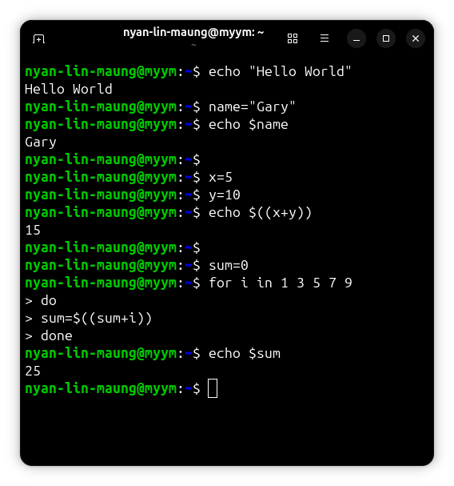
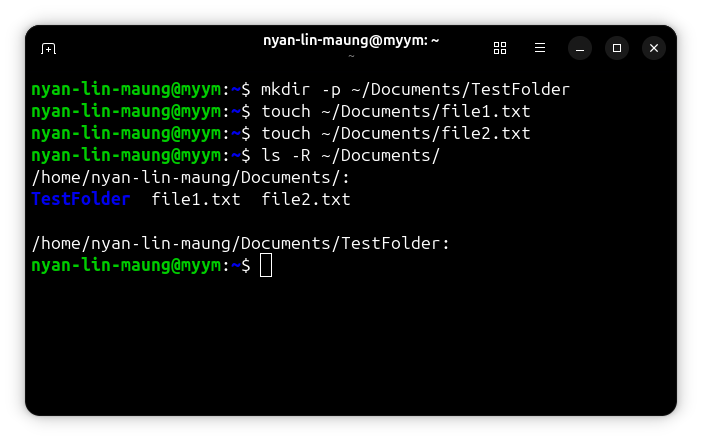
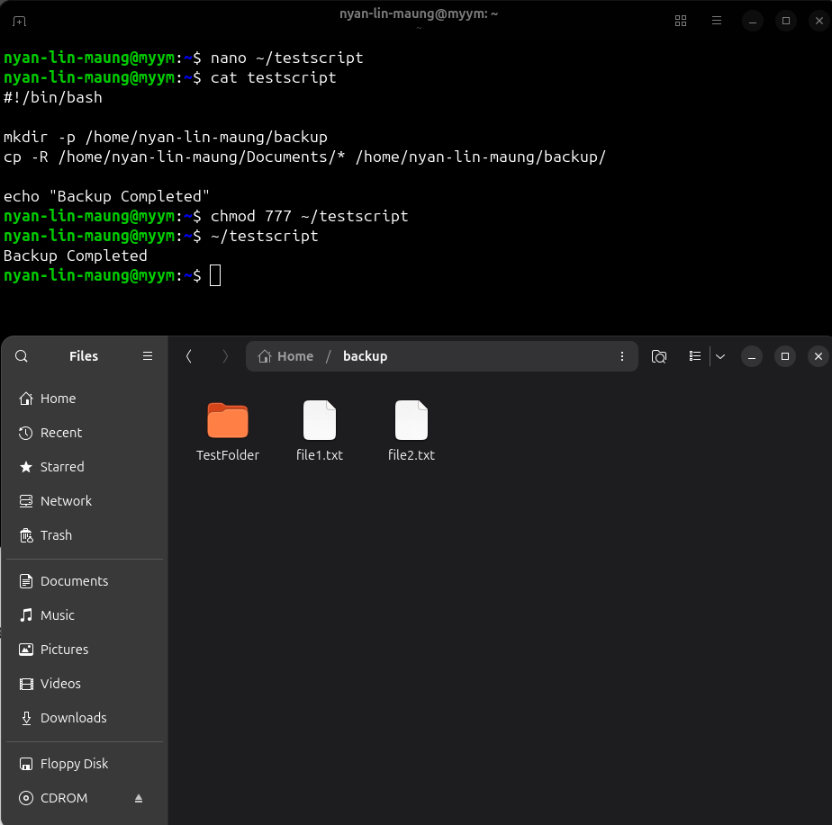
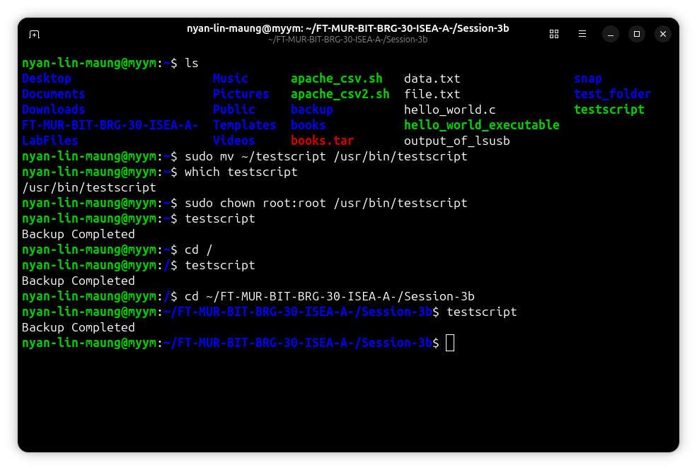
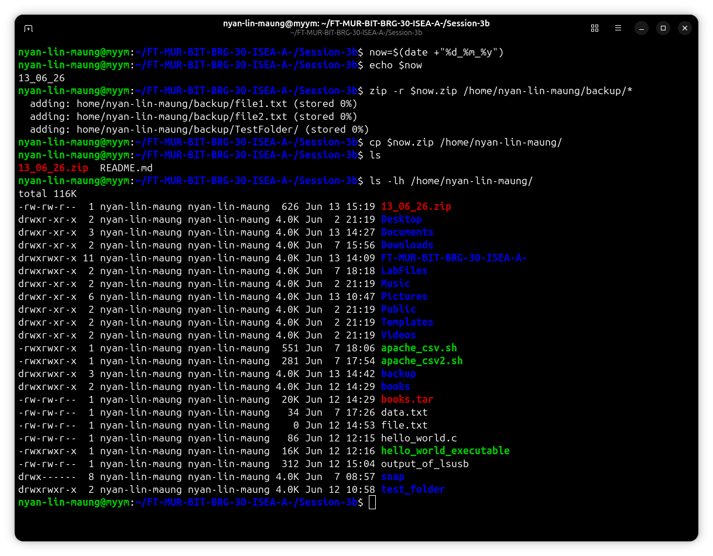
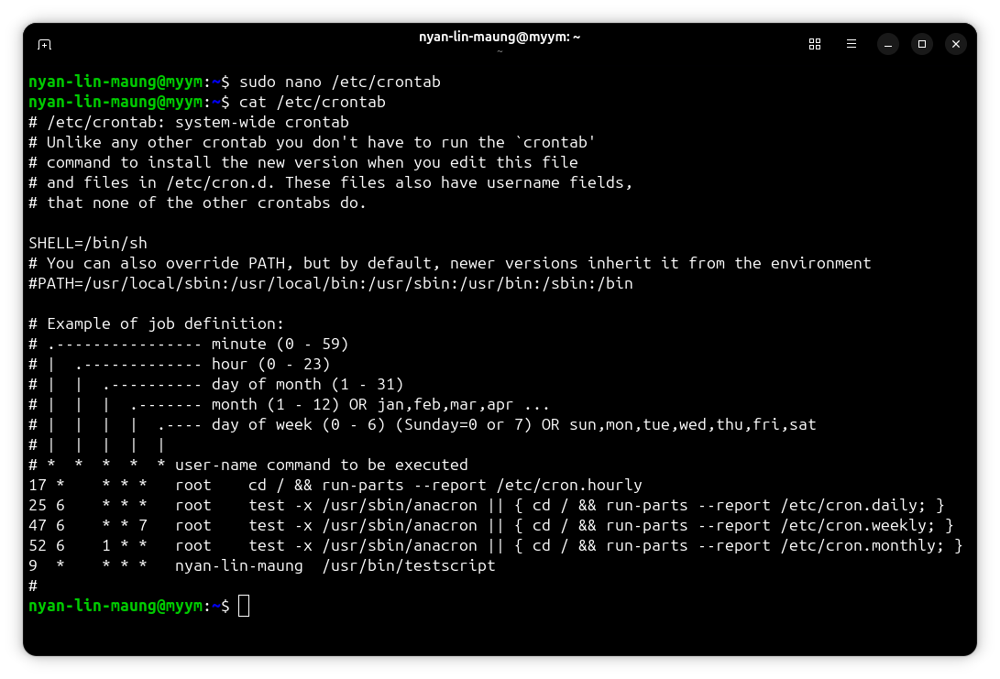
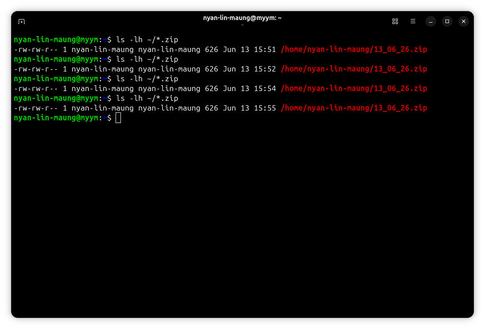
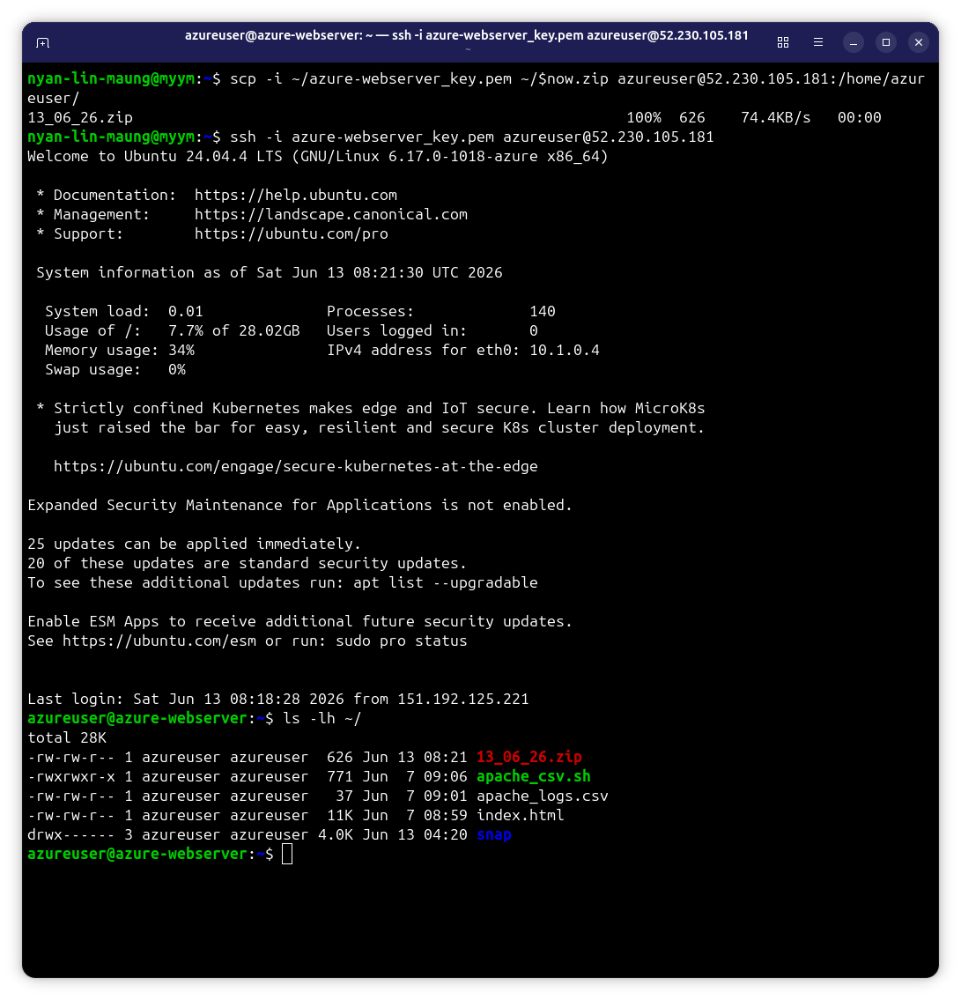
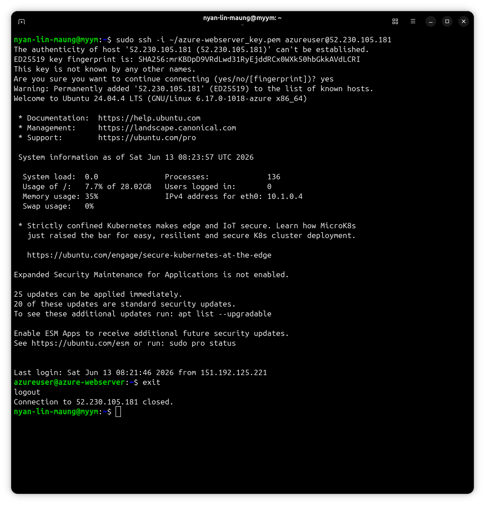
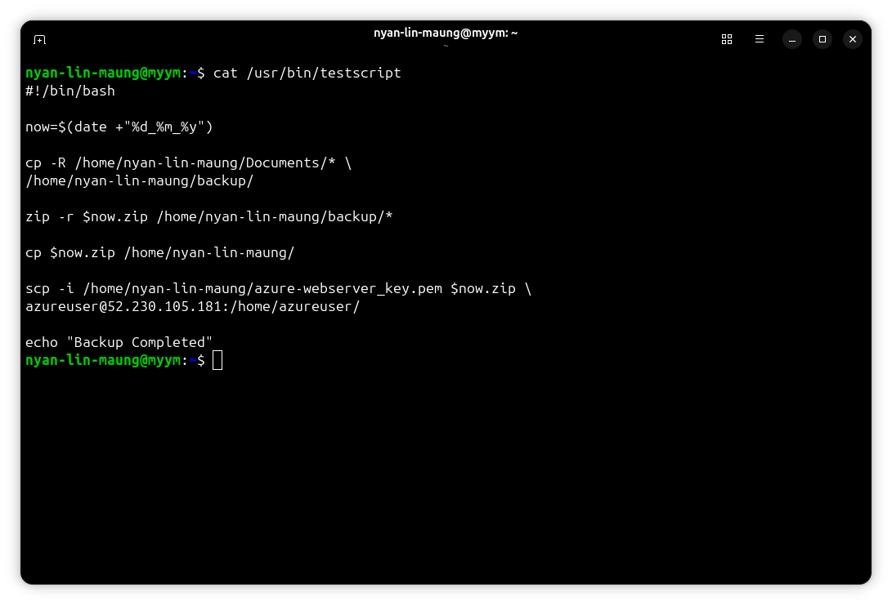

# Session 3b – Server Automation

# Lab Objective

The objective of this lab was to create and automate file backups using Bash scripting. The lab involved creating backup scripts, compressing files into ZIP archives, scheduling automated execution using cron jobs, and transferring backup files to a cloud server using SCP.


## Part 3b-1 - Bash Backup Scripting, Cron Jobs, and Cloud Export

## Deliverable 1: Practice Bash Commands Executed

Basic Bash commands were tested to demonstrate variables, arithmetic operations, and loops.

### Commands Used

```bash
echo "Hello World"

name="Gary"
echo $name

x=5
y=10
echo $((x+y))

sum=0
for i in 1 3 5 7 9
do
    sum=$((sum+i))
done
echo $sum
```



---

## Deliverable 2: Test Files & Directories Created

Test files and directories were created inside the Documents folder.

### Commands Used

```bash
mkdir -p ~/Documents/TestFolder
touch ~/Documents/file1.txt
touch ~/Documents/file2.txt
ls -R ~/Documents
```



---

## Deliverable 3: Basic Script Working (testscript)

A Bash script was created to copy files from Documents into a backup directory.

### Commands Used

Create script:

```bash
nano ~/testscript
```

Example script:

```bash
#!/bin/bash

mkdir -p /home/nyan-lin-maung/backup
cp -R /home/nyan-lin-maung/Documents/* /home/nyan-lin-maung/backup/

echo "Backup Completed"
```

Make executable:

```bash
chmod 777 ~/testscript
```

Run script:

```bash
~/testscript
```



---

## Deliverable 4: Script Moved to /usr/bin and Tested

The script was moved to a system directory so it could be executed from any location.

### Commands Used

```bash
sudo mv ~/testscript /usr/bin/testscript
sudo chown root:root /usr/bin/testscript
```

Test:

```bash
testscript
```



---

## Deliverable 5: ZIP Archive with Date Filename

The script was updated to generate a ZIP archive using the current date.

### Commands Used

```bash
now=$(date +"%d_%m_%y")
zip -r $now.zip /home/nyan-lin-maung/backup/*
cp $now.zip /home/nyan-lin-maung/
```

Check:

```bash
ls -lh /home/nyan-lin-maung
```



---

## Deliverable 6: Cronjob Set Up for Hourly Backup

A cron job was created to execute the backup script automatically every hour.

### Commands Used

Edit crontab:

```bash
sudo nano /etc/crontab
```

Add:

```bash
9 * * * * nyan-lin-maung /usr/bin/testscript
```

Verify:

```bash
cat /etc/crontab
```



---

## Deliverable 7: Successful Cron Execution Verified

The cron job was verified to create backup files automatically.

### Commands Used

```bash
ls -lh ~/*.zip
```

In this deliverable, I used

```bash
* * * * * nyan-lin-maung usr/bin/testscript
```

Instead of

```bash
9 * * * * nyan-lin-maung usr/bin/testscript
```

Proving the file backup every minute




---

## Deliverable 8: SCP to Cloud Working

The script was updated to transfer backups to a remote cloud server.

### Commands Used

```bash
scp -i azure-webserver_key.pem ~/$now.zip azureuser@52.230.105.181:/home/azureuser
```

Verify on remote server:

```bash
ls -lh ~/
```



---

## Deliverable 9: SSH Certificate Accepted by Root

SSH key authentication was tested and the host fingerprint was accepted.

### Commands Used

```bash
sudo ssh -i ~/azure-webserver_key.pem azure@52.230.105.181
```

When prompted:

```text
yes
```



---

## Deliverable 10: Final Script Submitted

The completed script contained:

* Recursive backup
* ZIP compression
* Date-based filenames
* SCP transfer
* Full paths for cron compatibility

### Example Final Script

```bash
#!/bin/bash

now=$(date +"%d_%m_%y")

mkdir -p /home/nyan-lin-maung/backup

cp -R /home/nyan-lin-maung/Documents/* \
/home/nyan-lin-maung/backup/

zip -r $now.zip /home/nyan-lin-maung/backup/*

cp $now.zip /home/nyan-lin-maung/

scp -i /home/nyan-lin-maung/azure-webserver_key.pem $now.zip \
azureuser@52.230.105.181:/home/azureuser/

echo "Backup Completed"
```



---

# Summary

This lab successfully demonstrated Bash scripting, automated backups, ZIP archive creation, cron job scheduling, and SCP file transfer. Backup automation was implemented and tested successfully, showing how Linux administration tasks can be automated using scripts and scheduled jobs.
